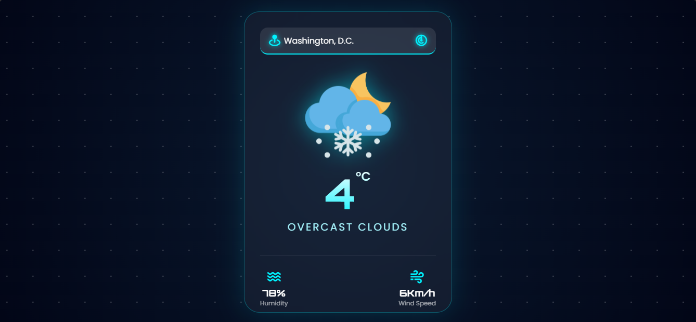
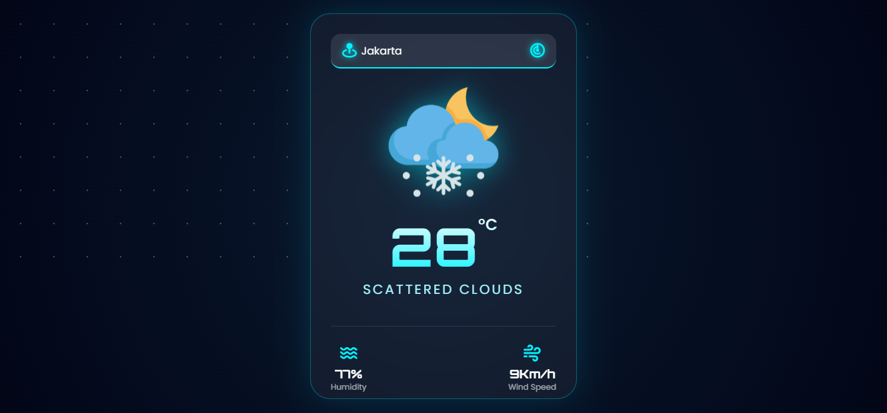
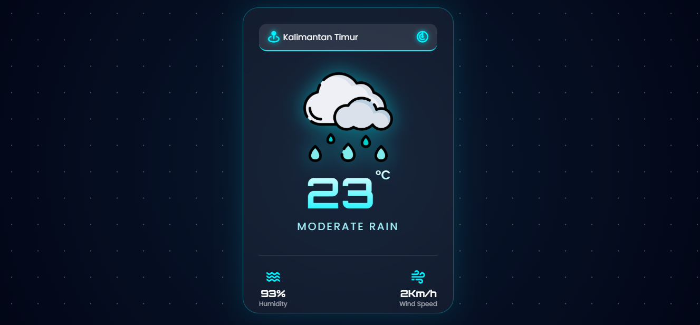

# 🌌 Weatherwise App - Galactic Edition
[](https://sovernbaezit.github.io/weatherwise-galactic-station/weatherwiseapp-beginner/) 
[]()

**Weatherwise App** adalah platform pemantauan cuaca berbasis web yang menggabungkan presisi data meteorologi dengan estetika visual modern. Mengusung konsep **Glassmorphism**, aplikasi ini dirancang untuk memberikan pengalaman pengguna yang imersif dan informatif dalam memantau kondisi atmosfer di berbagai belahan Bumi secara *real-time*.

---

## 📸 Preview Aplikasi
Berikut adalah dokumentasi antarmuka aplikasi saat menampilkan data cuaca dari berbagai koordinat lokasi:

| Washington, D.C. | Jakarta, ID | Kalimantan, ID |
| :---: | :---: | :---: |
|  |  |  |

---

## 🚀 Fitur Unggulan
* **Integrasi Data Real-time**: Menyajikan informasi cuaca akurat melalui sinkronisasi langsung dengan OpenWeatherMap API.
* **Antarmuka Glassmorphism**: Desain UI futuristik yang memanfaatkan efek transparansi dan blur (`backdrop-filter`) untuk tampilan yang elegan.
* **Animasi Dinamis**: Latar belakang bertema ruang angkasa dengan pergerakan bintang yang halus menggunakan CSS Keyframes.
* **Adaptasi Responsif**: Tampilan yang dioptimalkan untuk memastikan kenyamanan pengguna di berbagai ukuran layar, dari desktop hingga perangkat seluler.

---

## 🛠️ Stack Teknologi
1.  **HTML5**: Membangun struktur semantik aplikasi yang bersih dan terorganisir.
2.  **CSS3**: Implementasi desain tingkat lanjut termasuk Radial Gradients, Webkit Clips, dan animasi interaktif.
3.  **JavaScript (ES6+)**: Mengelola pengambilan data secara asinkron menggunakan *Fetch API* dan memperbarui informasi cuaca secara dinamis.
4.  **Google Fonts**: Menggunakan font *Orbitron* untuk nuansa teknologi dan *Poppins* untuk keterbacaan yang maksimal.

---

## 📂 Organisasi Proyek
Repositori ini disusun dengan struktur yang memudahkan pemeliharaan:
```text
weatherwiseapp-beginner/
├── index.html       # Struktur dasar dan elemen UI
├── style.css        # Gaya visual dan animasi galaksi
├── script.js        # Logika aplikasi dan integrasi API
└── *.png            # Dokumentasi preview visual aplikasi
README.md            # Dokumentasi lengkap proyek
